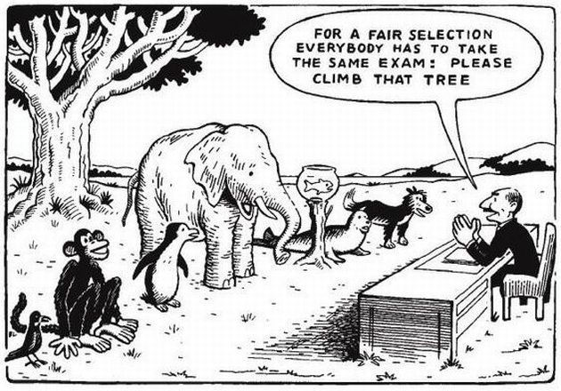

The desire to create, is something we all have in common.

The ability to create is not.

If you’re here, you’ve **felt the need to build something** in the digital realm. 

Be it a website, a shop, an app, even a game.

You’ve tried, and failed (and tried, and failed).

Felt overwhelmingly confident taking those first steps with the terminal, got that matrix vibe… and then as quick as it started, everything becomes complicated in ways you can hardly understand, let alone explain on Stack Overflow. 

We’ve all been here, and we know what happens next: frustrated, we say we’ll get back to it later, and catch ourselves opening Fiverr looking for someone who can deliver the MVP we’ve been craving … just to switch from parsing errors on Google to having endless chats trying to figure out if it’s worth it.

But if you’ve taken a look at the numbers, I trust you won’t be surprised to know that, with much less than the average MVP budget, you can learn how to code most apps & programs by yourself. With the additional costs of dedication & time, of course.

**For those few who desire this difficult path of knowledge & mastery above all others, I’m honored to be writing to you. I’ve made it my career to accompany and speed you along in this endeavor.**

If you just felt a quick tinge of “fuck u”, I get where you’re coming from. For most of us, learning has been a nearly traumatic experience: today’s schools make sure that by the time we graduate, every ounce of joy coming from exploration is sucked dry out of us.

Being an academic disappointment myself (barely finished high-school, making 6 figures at 27) I underwent a long process of unscrewing everything the educational system did to me so I could learn how to learn again, from scratch.

If all that sounds awesome to you, let’s talk now about our journey together.

**I have created a mentorship program that is unlike any course or bootcamp.**

Here’s why:

- **Avoid decision fatigue while letting your passion guide your learning process.**
- **Teach you how to think like a programmer and formulate precise questions.**
- **Help you overcome mental & emotional blocks from past bad learning experiences.**
- **Providing you with the best resources and tools to make choices.**
- **Course-correct you every time you might get overwhelmed and stray.**

You will learn how to create a high-quality web app that you can use or show to clients & employers. But most importantly, you will also have the skills and confidence to keep building and learning quickly by yourself new tools and languages.

We will be using HTML5, CSS3, JavaScript, React, Node.js, Express, connecting to APIs, and more.

Let’s look at the steps together more in detail:

- We will choose a project you would have done regardless of my help.
- We will break it down together and treat it the same way a product manager would. These will be the smallest moving parts on your machine.
- I will search and provide you with material tailored to your learning style, to help you build those components step by step. The tasks will always be:
	- Much more hands-on trial and error, than learning theory.
	- One step above your current level, to teach you not only how to do the specific task, but also how to ask the right questions and understand what knowledge you are lacking.
- Once you get stuck for any reason we will have a Zoom session. The sessions are focused mainly on your thought process and problem-solving abilities, rather than on me teaching your technical knowledge (this is what step 3 is for).
- PROFIT!!!

And most importantly, I will do my best to ensure you enjoy the process!

**My key objective is to lose you as a client.** When you know how to approach every kind of problem constructively and sensibly, my work is done.

Until then, you can start moving your next step towards building something awesome by having a [15 minute face time with me](https://calendly.com/ilya-dorman/student-consultation). I’d love to hear what you want to create.

— Ilya Dorman
